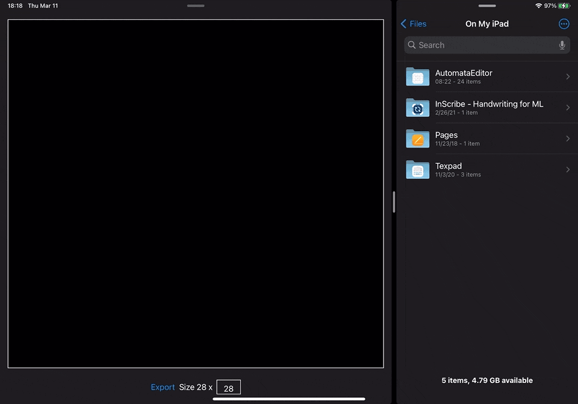

# MNIST Maker

MNIST Maker is an easy-to-use app that you can use to create a dataset for your machine learning model using MNIST-like dataset! 🤖

It works with a either a finger or Apple Pencil.

# Export

You can specify the size of the image you want to export.

The image itself is then exported in grayscale which is the ideal format for your machine learning to learn 👩‍🎓

# Download this App

Right now, I don't plan to publish this on AppStore (although that might change). But if you have Xcode and Apple Developer account, you can simply checkout this and be able to install it on your device by yourself.

# Why?

I am building an automata editor for which I need to create a custom CoreML model and I have not found a tool that would suit my needs - so, naturally, I built one! Let me know if you have any issues or you'd like to see some improvements 🤗